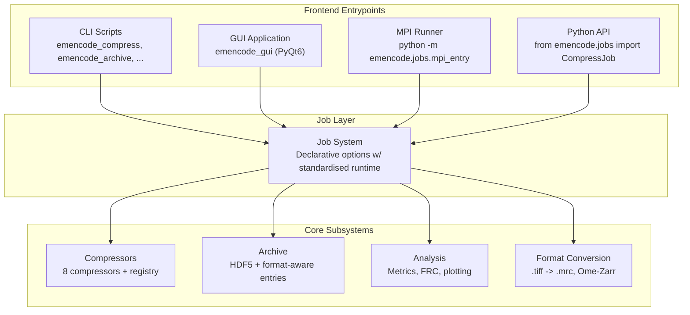
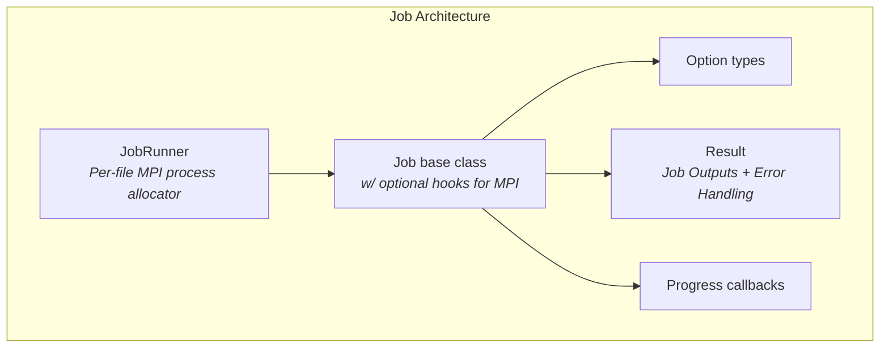

# EMencode - March 2026

Data compression and archival workflows for cryoEM datasets

---
layout: center
---

<Toc minDepth="1" maxDepth="1" />

---

# EMencode Project

---

# Data Compression

---

# Prior benchmarking work

---

# EMencode

---

# High-level Package Overview

---

# Interface (1)

All interfaces in EMencode are wrappers around jobs. All error handling, data validation, MPI ranking, and logging follows a consistent pattern. Hooking new functionality into the GUI/CLI/API just requires the job and some boilerplate. 

---

# Interface (2)

---

# HDF5 Archival

---

# Format Conversion

---

# Lossy Compression

---

# Feature Analysis

---

# Future Work

---
layout: center
hideInToc: True
---

# **Any questions?**

Links:
- EMencode Repository: https://gitlab.com/ccpem/data-compression-framework
- Toy version in rust: https://gitlab.com/willow-sparks/emencode-rs

